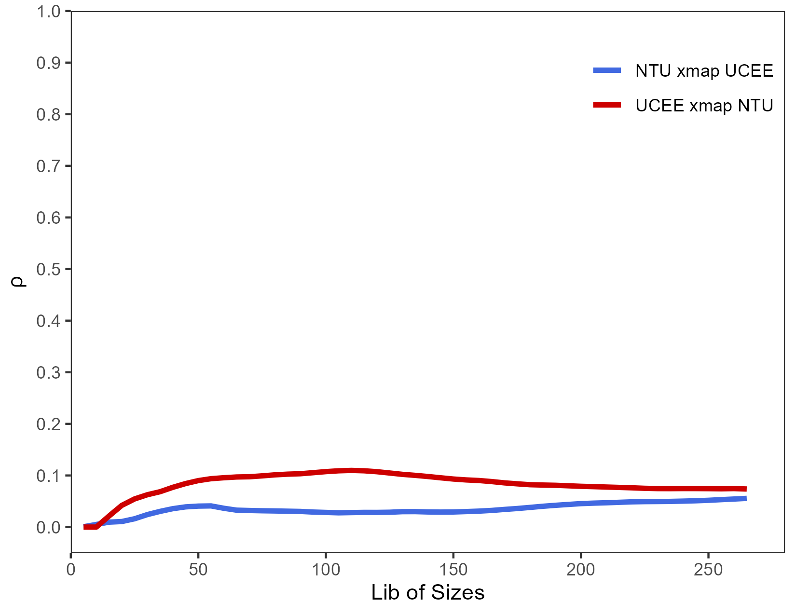

# Using R for Scientific Plotting

### Figure1 `Intensity Map of Causal Interactions in Dynamic Systems such as GCCM`

``` r
df = readr::read_csv('./data/GCCM_NTU_UCEE.csv')

windowsFonts(TNR = windowsFont("Times New Roman"))

fig_gccm = ggplot2::ggplot(data = df,
                ggplot2::aes(x = lib_sizes)) +
  ggplot2::geom_line(ggplot2::aes(y = x_xmap_y_means,
                                  color = "x xmap y"),
                      lwd = 1.25) +
  ggplot2::geom_line(ggplot2::aes(y = y_xmap_x_means,
                                  color = "y xmap x"),
                     lwd = 1.25) +
  ggplot2::scale_y_continuous(breaks = seq(0, 1, by = 0.1),
                              limits = c(-0.05, 1), expand = c(0, 0),
                              name = expression(rho)) +
  ggplot2::scale_x_continuous(name = "Lib of Sizes",
                              breaks = seq(0, 300, by = 50),
                              limits = c(0, 280), expand = c(0, 0)) +
  ggplot2::scale_color_manual(values = c("x xmap y" = "royalblue", "y xmap x" = "red3"), 
                              labels = c("NTU xmap UCEE", "UCEE xmap NTU"),
                              name = "") +
  ggplot2::theme_bw() +
  ggplot2::theme(axis.text = ggplot2::element_text(family = "TNR"),
                 axis.title = ggplot2::element_text(family = "TNR"),
                 panel.grid = ggplot2::element_blank(),
                 legend.position = "inside",
                 legend.justification = c('right','top'),
                 legend.background = ggplot2::element_rect(fill = 'transparent'),
                 legend.text = ggplot2::element_text(family = "TNR"))
```


