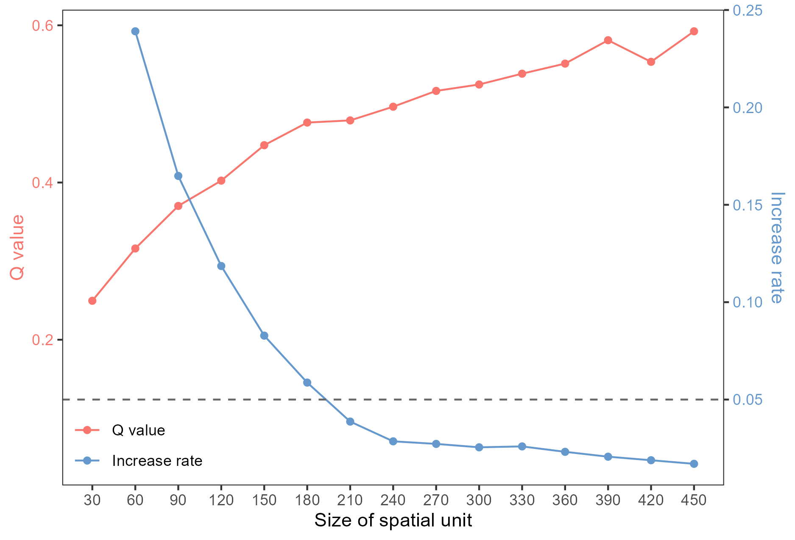
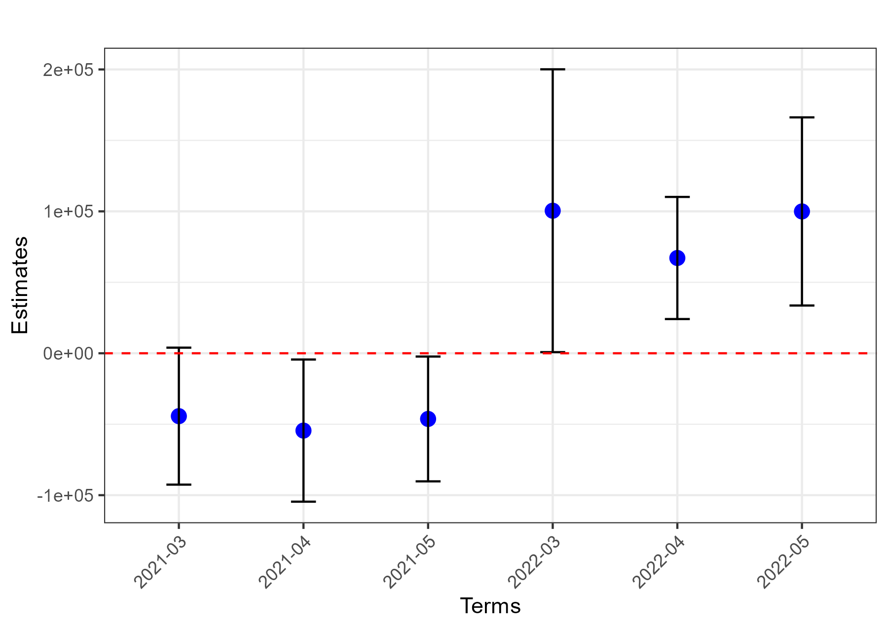
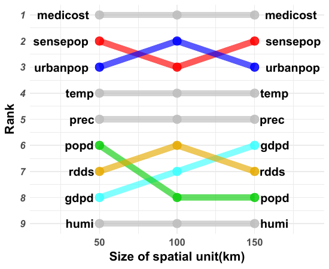

# Using R for Scientific Plotting

### Figure1 `Intensity Map of Causal Interactions in Dynamic Systems such as GCCM`

``` r
df = readr::read_csv('./data/GCCM_NTU_UCEE.csv')

windowsFonts(TNR = windowsFont("Times New Roman"))

fig_gccm = ggplot2::ggplot(data = df,
                           ggplot2::aes(x = lib_sizes)) +
  ggplot2::geom_line(ggplot2::aes(y = x_xmap_y_means,
                                  color = "x xmap y"),
                      lwd = 1.25) +
  ggplot2::geom_line(ggplot2::aes(y = y_xmap_x_means,
                                  color = "y xmap x"),
                     lwd = 1.25) +
  ggplot2::scale_y_continuous(breaks = seq(0, 1, by = 0.1),
                              limits = c(-0.05, 1), expand = c(0, 0),
                              name = expression(rho)) +
  ggplot2::scale_x_continuous(name = "Lib of Sizes",
                              breaks = seq(0, 300, by = 50),
                              limits = c(0, 280), expand = c(0, 0)) +
  ggplot2::scale_color_manual(values = c("x xmap y" = "royalblue", "y xmap x" = "red3"), 
                              labels = c("NTU xmap UCEE", "UCEE xmap NTU"),
                              name = "") +
  ggplot2::theme_bw() +
  ggplot2::theme(axis.text = ggplot2::element_text(family = "TNR"),
                 axis.title = ggplot2::element_text(family = "TNR"),
                 panel.grid = ggplot2::element_blank(),
                 legend.position = "inside",
                 legend.justification = c('right','top'),
                 legend.background = ggplot2::element_rect(fill = 'transparent'),
                 legend.text = ggplot2::element_text(family = "TNR")) +
  ggview::canvas(width = 5.5,height = 4.25)
```


### Figure2 `Plotting the optimal spatial analysis scale obtained from geographic detectors`

``` r
windowsFonts(TNR = windowsFont("Times New Roman"))

sesu_q = readr::read_csv('./data/SESU_GD.csv')

loessf = stats::loess(qv ~ su, data = sesu_q)
loessrate = (loessf$fitted - dplyr::lag(loessf$fitted)) / dplyr::lag(loessf$fitted)
sesu_q$rate = loessrate

maxrate = max(sesu_q$rate, na.rm = TRUE)
maxqv = max(sesu_q$qv)

fig_sesu = ggplot2::ggplot(data = sesu_q, ggplot2::aes(x = su)) +
  ggplot2::geom_line(ggplot2::aes(y = qv, color = "qv")) +
  ggplot2::geom_point(ggplot2::aes(y = qv, color = "qv")) +
  ggplot2::geom_line(ggplot2::aes(y = rate * maxqv / maxrate, color = "rate")) +
  ggplot2::geom_point(ggplot2::aes(y = rate * maxqv / maxrate, color = "rate")) +
  ggplot2::geom_hline(yintercept = 0.05 * maxqv / maxrate, 
                      color = "grey40", linetype = "dashed") +
  ggplot2::scale_color_manual(values = c("qv" = "#f8766d", "rate" = "#6598cc"), 
                              labels = c("Q value", "Increase rate"), name = "") +
  ggplot2::scale_x_continuous(
    name = "Size of spatial unit",
    breaks = sesu_q$su
  ) +
  ggplot2::scale_y_continuous(
    name = "Q value",
    sec.axis = ggplot2::sec_axis(~ . * maxrate / maxqv, 
                                 name = "Increase rate")
  ) +
  ggplot2::theme_bw() +
  ggplot2::theme(
    axis.title.y.right = ggplot2::element_text(color = "#6598cc"),
    axis.text.y.right = ggplot2::element_text(color = "#6598cc"),
    axis.title.y.left = ggplot2::element_text(color = "#f8766d"),
    axis.text.y.left = ggplot2::element_text(color = "#f8766d"),
    axis.text = ggplot2::element_text(family = "TNR"),
    axis.title = ggplot2::element_text(family = "TNR"),
    panel.grid = ggplot2::element_blank(),
    legend.text = ggplot2::element_text(family = "TNR"),
    legend.position = "inside",
    legend.justification = c('left','bottom'),
    legend.background = ggplot2::element_rect(fill = 'transparent')
  ) +
  ggview::canvas(width = 6.25,height = 4.25)
```



### Figure3 `Plotting the event treatment effects of a two-period DID estimate`

``` r
windowsFonts(TNR = windowsFont("Times New Roman"))

did_coef = readr::read_csv('./data/DID_Treat.csv')

fig_did = ggplot2::ggplot(did_coef, ggplot2::aes(x = term, 
                                              y = estimate)) +
  ggplot2::geom_point(size = 3, color = "blue") +
  ggplot2::geom_errorbar(ggplot2::aes(ymin = conf.low, 
                                      ymax = conf.high), 
                         width = 0.2) + 
  ggplot2::geom_hline(yintercept = 0, linetype = "dashed", color = "red") +
  ggplot2::theme_bw() +
  ggplot2::labs(title = "", x = "Terms", y = "Estimates") +
  ggplot2::theme(axis.text.x = ggplot2::element_text(angle = 45, hjust = 1, family = "TNR"),
                 axis.text = ggplot2::element_text(family = "TNR"),
                 axis.title = ggplot2::element_text(family = "TNR")) +
  ggview::canvas(width = 6, height = 4.25, bg = 'transparent')
```



### Figure4 `Changes in the rank of Q values under different spatial units`

``` r
windowsFonts(TNR = windowsFont("Times New Roman"))

qs = readr::read_csv('./data/H1N1_Qs.csv')

q_col = c(rep('grey',4),"#ff0000","#0000ff","#0ecf0e","#E6AB02","#3effff")
names(q_col) = c("medicost","temp","prec","humi","sensepop","urbanpop","popd","rdds","gdpd")

fig_sesu_rank = ggplot2::ggplot(qs, ggplot2::aes(x = su, y = rank, group = variable)) +
  ggplot2::geom_line(ggplot2::aes(color = variable), lwd = 3.5, alpha = 0.65) +
  ggplot2::geom_point(ggplot2::aes(color = variable), size = 4.5, alpha = 0.85) +  
  ggplot2::geom_text(data = dplyr::filter(qs,su == 50), 
                     ggplot2::aes(x = 50, y = rank, label = variable),
                     hjust = 1.2, size = 5, family = "TNR", fontface = "bold") +
  ggplot2::geom_text(data = dplyr::filter(qs,su == 150), 
                     ggplot2::aes(x = 150, y = rank, label = variable),
                     hjust = -0.2, size = 5, family = "TNR", fontface = "bold") +
  ggplot2::scale_color_manual(values = q_col) +
  ggplot2::scale_x_continuous(breaks = c(50, 100, 150),
                              expand = ggplot2::expansion(mult = c(0.45, 0.45))) +
  ggplot2::scale_y_reverse(breaks = 1:9) +
  ggplot2::labs(x = "Size of spatial unit(km)", y = "Rank") +
  ggplot2::theme_minimal() +
  ggplot2::theme(
    legend.position = "none",
    axis.text.y = ggplot2::element_text(size = 12,family = "TNR",face = "bold.italic"),
    axis.text.x = ggplot2::element_text(size = 12,family = "TNR",face = "bold"),
    axis.title.x = ggplot2::element_text(size = 15,family = "TNR",face = "bold"),
    axis.title.y = ggplot2::element_text(size = 15,family = "TNR",face = "bold")
  )+
  ggview::canvas(width = 5.5,height = 4.5)
```


